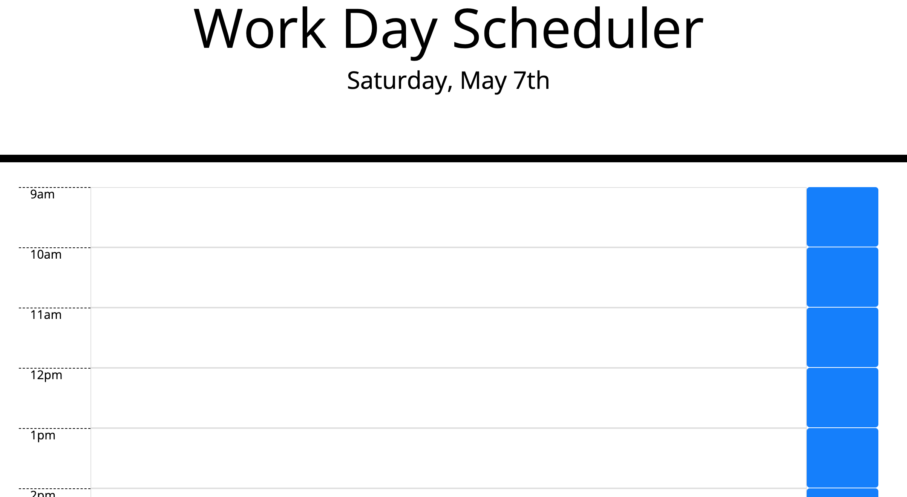

# Work-Day-Scheduler

## Summary

this project consists of workday time blocks that allows the user to input information inside and be able to save the inputted information onto local storage. 

the work hours of the day are displated on the right side of the input box.

the "save" button is displayed on the left hand side of the input box. 

this project uses a combination of:

* jQuery
* Bootstrap
* javaScript

## Deployed page
https://davidpascual2.github.io/Work-Day-Scheduler/

## Repository Link
https://github.com/davidpascual2/Work-Day-Scheduler

## Preview

